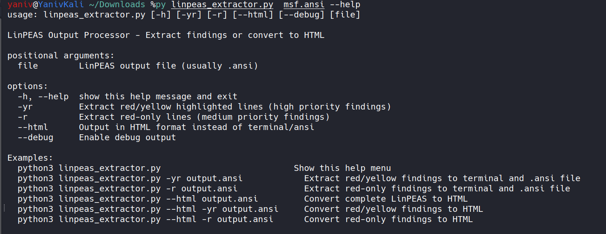

# LinPEAS Report Processor

A Python3 utility to extract and convert [LinPEAS](https://github.com/carlospolop/PEASS-ng/tree/master/linPEAS) security scan findings into readable formats.

## About LinPEAS

[LinPEAS (Linux Privilege Escalation Awesome Script)](https://github.com/carlospolop/PEASS-ng) is a powerful enumeration script that searches for possible paths to escalate privileges on Linux/Unix systems. It's part of the PEASS-ng (Privilege Escalation Awesome Scripts SUITE) project by [Carlos Polop](https://github.com/carlospolop).

LinPEAS output can be overwhelming with thousands of lines. This tool helps you focus on the most critical findings by extracting only the highlighted security issues and converting them to clean, readable formats.

## How LinPEAS Color Coding Works

LinPEAS uses ANSI color codes to highlight findings by severity:
- **Red/Yellow Background** (`-yr` mode): Highest priority findings - potential privilege escalation vectors
- **Red Text Only** (`-r` mode): Medium priority findings - interesting information that may lead to privilege escalation
- **Other colors**: Lower priority informational data

This tool extracts only the red/yellow and red-only findings, filtering out the noise to help you focus on what matters most during privilege escalation assessments.

## Features

- Terminal-mode extraction of red/yellow or red-only highlights
- HTML conversion of full report or extracted findings
- Debug mode for internal parsing details

## Requirements

- Python 3 (Kali GNU/Linux Rolling)
- Standard libraries: `re`, `sys`, `argparse`, `datetime`, `os`

## Installation

```bash
chmod +x linpeas_extractor.py
# (Optionally) install to system PATH:
# sudo mv linpeas_extractor.py /usr/local/bin/linpeas_extractor
```

## Usage Examples

### 1. Show Help Screen

```bash
python3 linpeas_extractor.py
```



### 2. Extract Red/Yellow to Terminal

```bash
python3 linpeas_extractor.py -yr output.ansi
```


### 3. Extract Red-Only to Terminal

```bash
python3 linpeas_extractor.py -r output.ansi
```


### 4. Convert Entire Report to HTML

```bash
python3 linpeas_extractor.py --html output.ansi
```

### 5. Convert Extracted Findings to HTML

#### Red/Yellow Findings
```bash
python3 linpeas_extractor.py --html -yr output.ansi
```


#### Red-Only Findings
```bash
python3 linpeas_extractor.py --html -r output.ansi
```


## Author

Created by [Yaniv Haliwa](https://github.com/YanivHaliwa) for security testing and educational purposes.
